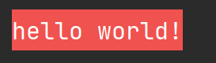

# go-console-color
you can use it to add background color to your console text

colors which you can choose:
* green
* red 
* cyan 
* blue 
* yellow 
* white
* purple 
* gray

🎈 First
```shell
go get -u github.com/z-spring/go-console-color
```
🧨 Second

you can add alias with this module
```go
import color "github.com/z-spring/go-console-color"
```

🎭 Third 

Just use NewColor().String() or Int64 or Float64 to output text with bacolor

Example:
```go
c := NewColor(color.Red)
text := c.String("hello world!") 
fmt.Println(text)
```
output:



That's all~

